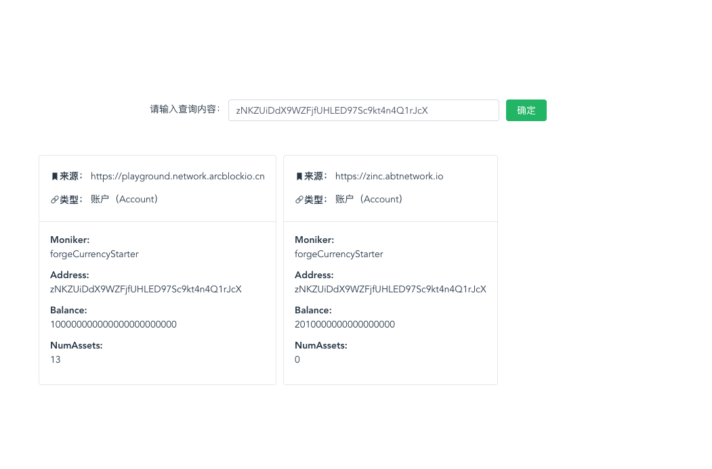
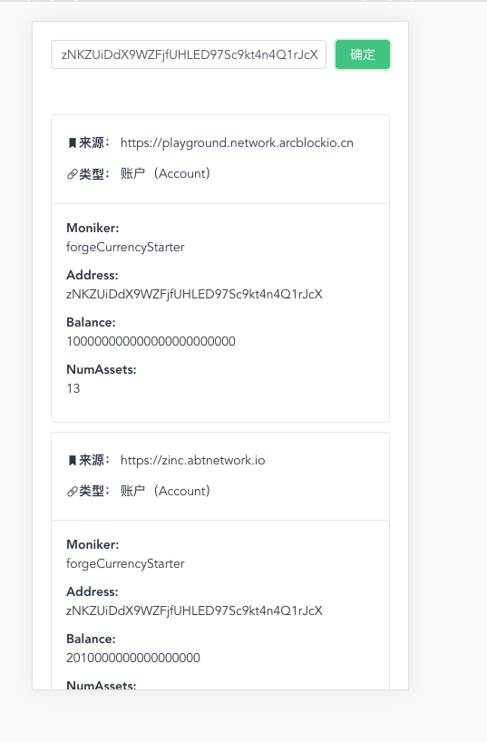

# 链网超级搜索框

# 主要内容

- [项目背景](#项目背景)
- [安装](#安装)
- [使用](#使用)
  - [启动开发环境](#启动开发环境)
  - [编译生产内容](#编译生产内容)
- [部署](#部署)
- [项目功能](#项目功能)
- [TODO](#TODO)

## 项目背景

> 查询官方链网的几条链是否存在对应的记录：账户、交易、资产。
> 展示命中记录类型、属于哪条链、命中记录的摘要卡片

## 安装

这个项目用到 node 和 npm，使用前请检查本地是否安装。

```
git clone git@github.com:leermao/blocklet_demo.git
yarn install
```

## 使用

### 启动开发环境

#### 前端

```
yarn serve
```

#### 后端

```
node server/app.js
```

### 编译生产内容

```
npm run build
```

### 部署

```
abtnode deploy .
```

### 项目功能

##### PC 端



##### M 端



### TODO

- [ ] 修复 ui 样式
